# Credential Tester Project

This project contains two implementations of a credential testing tool - one in Python and one in TypeScript/Node.js. Both tools perform the same functionality for educational and authorized testing purposes.

## Project Structure

```
Test/
├── python/                 # Python implementation
│   ├── main.py            # Main Python script
│   └── README.md          # Python-specific documentation
├── nodejs/                # Node.js/TypeScript implementation
│   ├── src/
│   │   └── main.ts        # Main TypeScript source
│   ├── package.json       # Node.js dependencies
│   ├── tsconfig.json      # TypeScript configuration
│   └── README.md          # Node.js-specific documentation
└── README.md              # This file
```

## Features (Both Implementations)

- **Comprehensive Testing**: Tests 10-digit user IDs (1000000000-9999999999) with 5-digit passwords (11111-99999)
- **Rate Limiting**: Respects server resources with appropriate delays
- **Retry Logic**: Handles network errors with automatic retries
- **Progress Tracking**: Shows real-time progress and statistics
- **Professional Output**: Clean, emoji-free console output
- **Auto-Start**: No manual confirmations required - starts automatically after 3-second delay
- **Early Termination**: Stops after finding 5 valid credentials

## Quick Start

### Python Version
```bash
cd python
pip install requests beautifulsoup4
python3 main.py
```

### Node.js Version
```bash
cd nodejs
npm install
npm run dev
```

## ⚠️ Important Safety Notice

**ETHICAL USE ONLY**: These tools are designed for educational purposes and authorized penetration testing only. 

**Requirements:**
- You MUST have explicit written permission to test the target website
- Respect server resources and implement appropriate rate limiting
- Use only on systems you own or have explicit authorization to test
- Consider the massive scale of testing (billions of combinations)

**Legal Disclaimer**: The authors are not responsible for any misuse of these tools. Users are solely responsible for ensuring they have proper authorization before using these tools on any system.

## Target Configuration

Both tools are configured to test:
- **Target**: https://parentsalarmapp.com
- **User ID Range**: 1000000000 to 9999999999 (10-digit numbers)
- **Password Range**: 11111 to 99999 (5-digit numbers)
- **Total Combinations**: ~89 billion combinations
- **Estimated Time**: ~5,000 hours (208 days) at 0.2s per request

## Technical Details

### Python Implementation
- Uses `requests` library for HTTP requests
- Uses `BeautifulSoup` for HTML parsing
- Session management with cookie handling
- Console output with emojis and progress bars

### Node.js Implementation
- Uses `axios` for HTTP requests
- Uses `cheerio` for HTML parsing (jQuery-like server-side)
- TypeScript for type safety
- Modern async/await patterns
- Fresh axios instances for each attempt to ensure clean state

Both implementations maintain feature parity and produce equivalent results.

# Brute Force Attack Explained

## Overview
This diagram illustrates how brute force attacks work - a trial-and-error method used to decode encrypted data by systematically trying all possible combinations.

## Attack Flow Diagram

```mermaid
graph TD
    A[🎯 Target System] --> B{Authentication Required}
    B --> C[🔐 Login Form]
    
    C --> D[👤 Attacker]
    D --> E[📋 Password List/Generator]
    
    E --> F{Try Password #1}
    F -->|❌ Failed| G{Try Password #2}
    G -->|❌ Failed| H{Try Password #3}
    H -->|❌ Failed| I[... Continue trying ...]
    I -->|❌ Failed| J{Try Password #N}
    J -->|✅ Success!| K[🚪 Access Granted]
    J -->|❌ Failed| E
    
    F -->|✅ Match| K
    G -->|✅ Match| K
    H -->|✅ Match| K
    
    K --> L[🎉 System Compromised]
    
    style A fill:#ff6b6b
    style D fill:#ffd93d
    style K fill:#6bcf7f
    style L fill:#ff6b6b
    style E fill:#a8daff
```



## How Brute Force Works

**Brute Force** is a straightforward attack method where an attacker:

1. **Identifies a target** - Usually a login page or encrypted data
2. **Generates attempts** - Creates passwords using:
   - Dictionary lists (common passwords)
   - Character combinations (a-z, 0-9, symbols)
   - Pattern-based guessing
3. **Tests systematically** - Tries each possibility one by one
4. **Continues until success** - Keeps going until the correct password is found

## Attack Process

```mermaid
sequenceDiagram
    participant A as Attacker
    participant S as Target System
    
    loop Until Success
        A->>S: Try Password Attempt
        alt Incorrect Password
            S-->>A: ❌ Access Denied
        else Correct Password
            S-->>A: ✅ Access Granted
        end
    end
```



## Defense Mechanisms

| Defense | Description | Effectiveness |
|---------|-------------|---------------|
| **Rate Limiting** ⏱️ | Slow down login attempts | High |
| **Account Lockout** 🔒 | Lock accounts after failed attempts | High |
| **CAPTCHA** 🤖 | Verify human users | Medium-High |
| **Strong Passwords** 💪 | Use long, complex passwords | Very High |
| **Multi-Factor Authentication** 📱 | Require additional verification | Very High |
| **IP Blocking** 🚫 | Block suspicious IP addresses | Medium |

## Time Complexity

| Password Type | Time to Crack |
|--------------|---------------|
| 4 characters (lowercase) | Seconds ⚡ |
| 8 characters (mixed) | Hours/Days 🕐 |
| 12 characters (complex) | Years 📅 |
| 16+ characters (complex) | Centuries 🏛️ |

*Note: Times vary based on password complexity and computing power*

## Types of Brute Force Attacks


## Prevention Best Practices

✅ **Use strong, unique passwords** (16+ characters with mixed case, numbers, symbols)  
✅ **Enable Multi-Factor Authentication (MFA)** on all accounts  
✅ **Implement account lockout policies** after 3-5 failed attempts  
✅ **Use rate limiting** to slow down attackers  
✅ **Monitor for suspicious login patterns**  
✅ **Educate users** about password security  

---

**⚠️ Educational Purpose Only**

This information is provided for educational and defensive security purposes. Unauthorized access to computer systems is illegal and unethical.

**Remember:** Brute force attacks exploit weak passwords and lack of security measures. Always use strong, unique passwords and enable multi-factor authentication!
