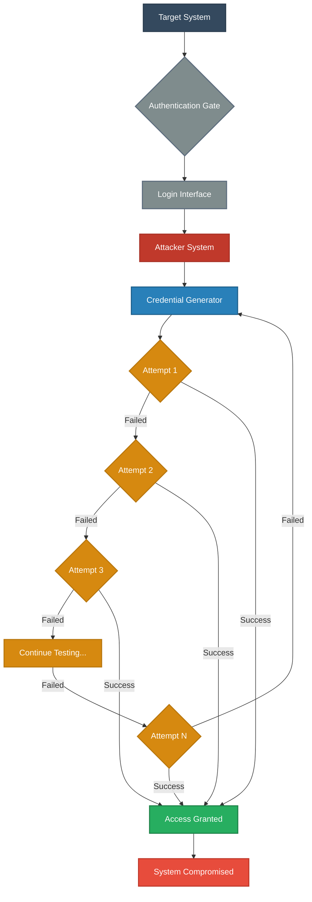
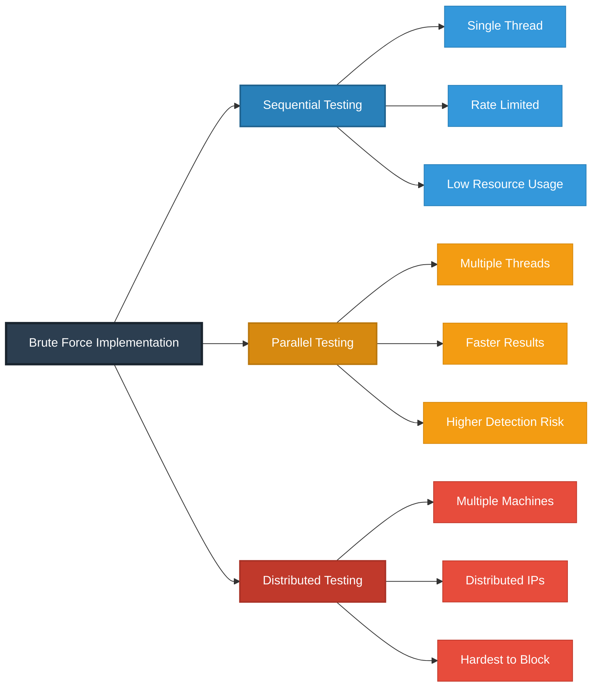
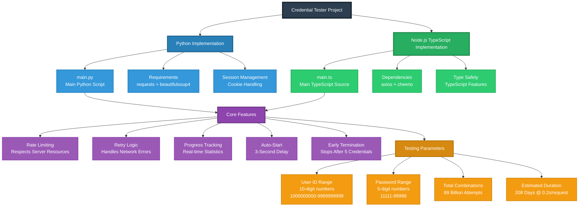

# Credential Tester Project

This project contains two implementations of a credential testing tool - one in Python and one in TypeScript/Node.js. Both tools perform the same functionality for educational and authorized testing purposes.

## Project Structure

```
Test/
├── python/                 # Python implementation
│   ├── main.py            # Main Python script
│   └── README.md          # Python-specific documentation
├── nodejs/                # Node.js/TypeScript implementation
│   ├── src/
│   │   └── main.ts        # Main TypeScript source
│   ├── package.json       # Node.js dependencies
│   ├── tsconfig.json      # TypeScript configuration
│   └── README.md          # Node.js-specific documentation
└── README.md              # This file
```

## Features (Both Implementations)

- **Comprehensive Testing**: Tests 10-digit user IDs (1000000000-9999999999) with 5-digit passwords (11111-99999)
- **Rate Limiting**: Respects server resources with appropriate delays
- **Retry Logic**: Handles network errors with automatic retries
- **Progress Tracking**: Shows real-time progress and statistics
- **Professional Output**: Clean, emoji-free console output
- **Auto-Start**: No manual confirmations required - starts automatically after 3-second delay
- **Early Termination**: Stops after finding 5 valid credentials

## Quick Start

### Python Version
```bash
cd python
pip install requests beautifulsoup4
python3 main.py
```

### Node.js Version
```bash
cd nodejs
npm install
npm run dev
```

## ⚠️ Important Safety Notice

**ETHICAL USE ONLY**: These tools are designed for educational purposes and authorized penetration testing only.

**Requirements:**
- You MUST have explicit written permission to test the target website
- Respect server resources and implement appropriate rate limiting
- Use only on systems you own or have explicit authorization to test
- Consider the massive scale of testing (billions of combinations)

**Legal Disclaimer**: The authors are not responsible for any misuse of these tools. Users are solely responsible for ensuring they have proper authorization before using these tools on any system.

## Target Configuration

Both tools are configured to test:
- **Target**: https://parentsalarmapp.com
- **User ID Range**: 1000000000 to 9999999999 (10-digit numbers)
- **Password Range**: 11111 to 99999 (5-digit numbers)
- **Total Combinations**: ~89 billion combinations
- **Estimated Time**: ~5,000 hours (208 days) at 0.2s per request

## Technical Details

### Python Implementation
- Uses `requests` library for HTTP requests
- Uses `BeautifulSoup` for HTML parsing
- Session management with cookie handling
- Console output with emojis and progress bars

### Node.js Implementation
- Uses `axios` for HTTP requests
- Uses `cheerio` for HTML parsing (jQuery-like server-side)
- TypeScript for type safety
- Modern async/await patterns
- Fresh axios instances for each attempt to ensure clean state

Both implementations maintain feature parity and produce equivalent results.

---

# Understanding Brute Force Attacks

## Overview

This section explains how brute force attacks work - a systematic trial-and-error method used to decode encrypted data or gain unauthorized access by attempting all possible combinations.

## Attack Flow Architecture



## How Brute Force Attacks Work

**Brute Force** is a systematic attack method where an attacker:

1. **Identifies a target** - Usually a login page, encrypted file, or authentication system
2. **Generates credential combinations** - Creates passwords using:
   - Dictionary lists containing common passwords
   - Character combinations (alphanumeric + symbols)
   - Pattern-based guessing algorithms
   - Previously leaked credential databases
3. **Tests systematically** - Attempts each possibility sequentially or in parallel
4. **Continues until success** - Persists until the correct credentials are found or resources are exhausted

## Attack Process Sequence


## Implementation Approaches



## Defense Mechanisms

| Defense Strategy | Implementation | Effectiveness | Impact on UX |
|-----------------|----------------|---------------|--------------|
| **Rate Limiting** | Limit login attempts per time window | High | Low |
| **Account Lockout** | Temporary/permanent lock after N failures | Very High | Medium |
| **CAPTCHA/reCAPTCHA** | Human verification challenges | High | Medium |
| **Strong Password Policy** | Enforce complexity requirements | Very High | Low |
| **Multi-Factor Authentication** | Require additional verification factor | Excellent | Medium |
| **IP Reputation Blocking** | Block known malicious IP ranges | Medium | Low |
| **Behavioral Analysis** | Detect automated patterns | High | Very Low |
| **Progressive Delays** | Increase delay after each failure | High | Low |

## Attack Type Taxonomy

```mermaid
graph TB
    A[Brute Force Attack Types] --> B[Simple Brute Force]
    A --> C[Dictionary Attack]
    A --> D[Hybrid Attack]
    A --> E[Rainbow Table]
    A --> F[Credential Stuffing]
    A --> G[Reverse Brute Force]
    
    B --> B1[Exhaustive search]
    B --> B2[No prior knowledge]
    B --> B3[All combinations]
    
    C --> C1[Common passwords]
    C --> C2[Wordlist based]
    C --> C3[Language patterns]
    
    D --> D1[Dictionary rules]
    D --> D2[Character substitution]
    D --> D3[Pattern mutations]
    
    E --> E1[Precomputed hashes]
    E --> E2[Fast lookups]
    E --> E3[Storage intensive]
    
    F --> F1[Leaked databases]
    F --> F2[Cross site testing]
    F --> F3[High success rate]
    
    G --> G1[Fixed password]
    G --> G2[Multiple usernames]
    G --> G3[Organizational targets]
    
    style A fill:#2c3e50,stroke:#1a252f,stroke-width:3px,color:#fff
    style B fill:#e74c3c,stroke:#c0392b,stroke-width:2px,color:#fff
    style C fill:#3498db,stroke:#2980b9,stroke-width:2px,color:#fff
    style D fill:#9b59b6,stroke:#8e44ad,stroke-width:2px,color:#fff
    style E fill:#f39c12,stroke:#d68910,stroke-width:2px,color:#fff
    style F fill:#1abc9c,stroke:#16a085,stroke-width:2px,color:#fff
    style G fill:#e67e22,stroke:#d35400,stroke-width:2px,color:#fff
    style B1 fill:#ec7063,stroke:#e74c3c,stroke-width:1px,color:#fff
    style B2 fill:#ec7063,stroke:#e74c3c,stroke-width:1px,color:#fff
    style B3 fill:#ec7063,stroke:#e74c3c,stroke-width:1px,color:#fff
    style C1 fill:#5dade2,stroke:#3498db,stroke-width:1px,color:#fff
    style C2 fill:#5dade2,stroke:#3498db,stroke-width:1px,color:#fff
    style C3 fill:#5dade2,stroke:#3498db,stroke-width:1px,color:#fff
    style D1 fill:#af7ac5,stroke:#9b59b6,stroke-width:1px,color:#fff
    style D2 fill:#af7ac5,stroke:#9b59b6,stroke-width:1px,color:#fff
    style D3 fill:#af7ac5,stroke:#9b59b6,stroke-width:1px,color:#fff
    style E1 fill:#f5b041,stroke:#f39c12,stroke-width:1px,color:#fff
    style E2 fill:#f5b041,stroke:#f39c12,stroke-width:1px,color:#fff
    style E3 fill:#f5b041,stroke:#f39c12,stroke-width:1px,color:#fff
    style F1 fill:#48c9b0,stroke:#1abc9c,stroke-width:1px,color:#fff
    style F2 fill:#48c9b0,stroke:#1abc9c,stroke-width:1px,color:#fff
    style F3 fill:#48c9b0,stroke:#1abc9c,stroke-width:1px,color:#fff
    style G1 fill:#eb984e,stroke:#e67e22,stroke-width:1px,color:#fff
    style G2 fill:#eb984e,stroke:#e67e22,stroke-width:1px,color:#fff
    style G3 fill:#eb984e,stroke:#e67e22,stroke-width:1px,color:#fff
```



## Complexity Analysis

### Time to Crack by Password Strength

| Password Type | Character Set | Length | Combinations | Time @ 1000/sec |
|--------------|---------------|--------|--------------|-----------------|
| Numeric only | 10 chars | 4 digits | 10,000 | 10 seconds |
| Numeric only | 10 chars | 6 digits | 1,000,000 | 16 minutes |
| Lowercase | 26 chars | 6 chars | 308M | 3.6 days |
| Mixed case | 52 chars | 8 chars | 53 trillion | 1,684 years |
| Full complexity | 94 chars | 10 chars | 54 quadrillion | 1.7M years |
| Full complexity | 94 chars | 12 chars | 475 sextillion | 15B years |

**Note:** Times assume 1,000 attempts per second. Modern hardware and distributed systems can achieve much higher rates.

## Project Architecture Diagram



## Prevention Best Practices

### For System Administrators

**Implement Multiple Defense Layers:**
- Enable rate limiting at both application and infrastructure levels
- Implement progressive delays that increase with failed attempts
- Use account lockout policies (temporary lock after 3-5 failures)
- Deploy Web Application Firewall (WAF) with brute force protection
- Monitor authentication logs for suspicious patterns
- Implement CAPTCHA after repeated failures
- Use IP reputation services to block known attack sources

### For End Users

**Create Strong Authentication:**
- Use passwords with minimum 12 characters (16+ recommended)
- Include uppercase, lowercase, numbers, and symbols
- Avoid common words, patterns, or personal information
- Use unique passwords for each service
- Enable Multi-Factor Authentication (MFA) wherever available
- Consider using password managers for strong, unique passwords
- Regularly update passwords for sensitive accounts

### For Developers

**Build Secure Systems:**
- Implement server-side validation and rate limiting
- Use secure hashing algorithms (bcrypt, Argon2, scrypt)
- Add salt to password hashes to prevent rainbow table attacks
- Log authentication attempts for security monitoring
- Implement account recovery processes that don't leak information
- Use HTTPS to encrypt credentials in transit
- Consider implementing anomaly detection systems

## Ethical Considerations

### Legal Requirements
- **Written Authorization Required:** Always obtain explicit written permission before testing
- **Scope Definition:** Clearly define what systems and methods are authorized
- **Time Windows:** Respect any time restrictions in your authorization
- **Reporting:** Document and report findings according to agreements

### Responsible Disclosure
- Report vulnerabilities through proper channels
- Allow reasonable time for fixes before public disclosure
- Provide detailed, actionable information to affected parties
- Follow coordinated disclosure practices

### Professional Ethics
- Respect privacy and confidentiality
- Minimize impact on production systems
- Use findings only for defensive purposes
- Educate rather than exploit

## Warning

**CRITICAL NOTICE:** This documentation is provided for educational purposes and authorized security testing only.

**Unauthorized use of these techniques is:**
- Illegal in most jurisdictions
- Unethical and harmful
- Punishable by severe criminal penalties
- Damaging to individuals and organizations

**The authors and contributors:**
- Are not responsible for any misuse of this information
- Do not condone or support unauthorized access attempts
- Expect users to comply with all applicable laws
- Require explicit authorization before any testing

**Before proceeding, ensure you have:**
- Written permission from system owners
- Clear scope and boundaries defined
- Understanding of legal implications
- Appropriate liability insurance (for professionals)

## Resources

**Learn More About Security:**
- OWASP Authentication Cheat Sheet
- NIST Digital Identity Guidelines
- CWE-307: Improper Restriction of Excessive Authentication Attempts
- SANS Institute Security Resources

**Authorized Testing:**
- Bug bounty programs (HackerOne, Bugcrowd)
- Penetration testing certifications (OSCP, CEH)
- Security training platforms (HackTheBox, TryHackMe)

---

**Remember:** With great power comes great responsibility. Use this knowledge to build more secure systems, not to break them.
